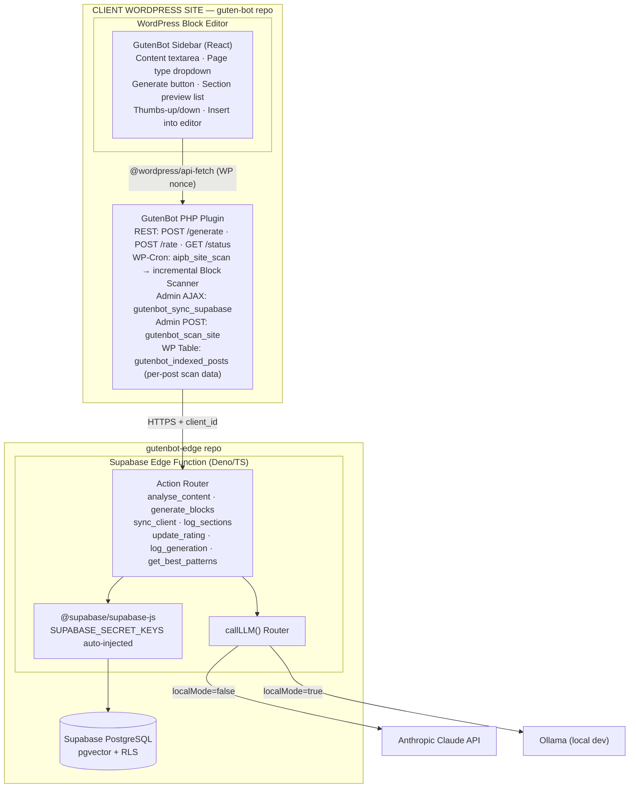
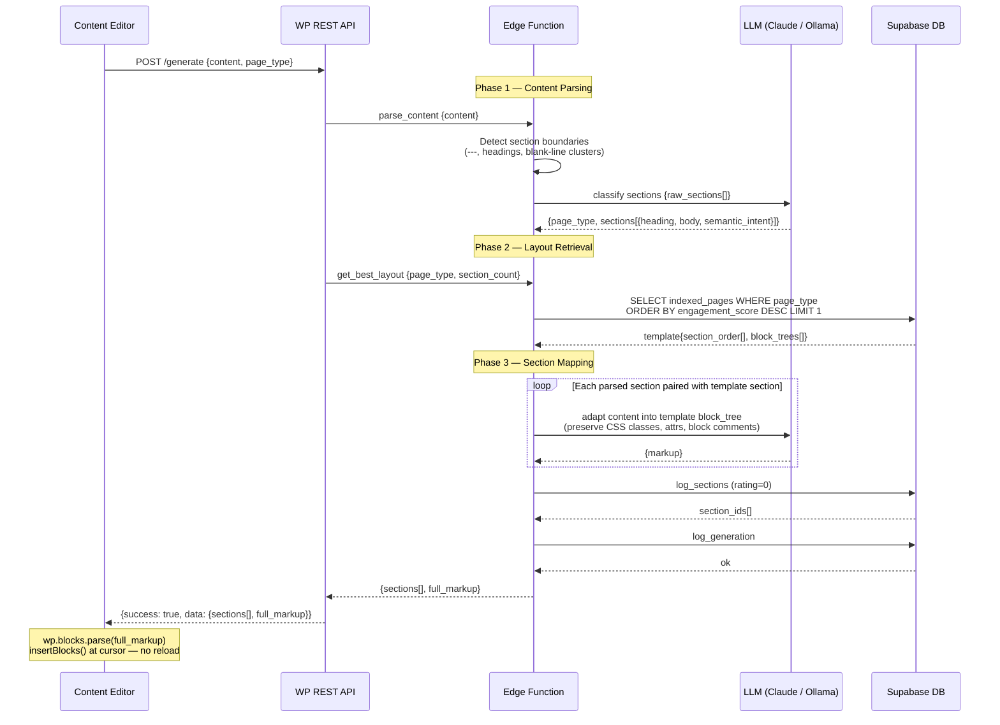
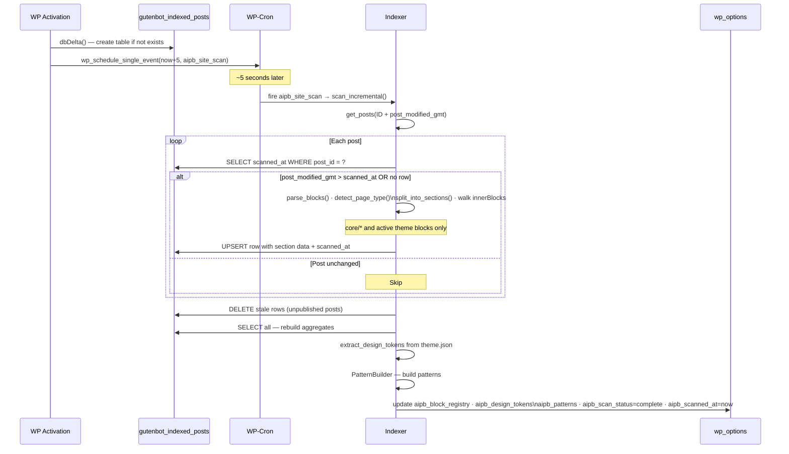
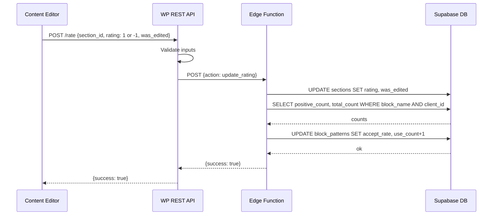
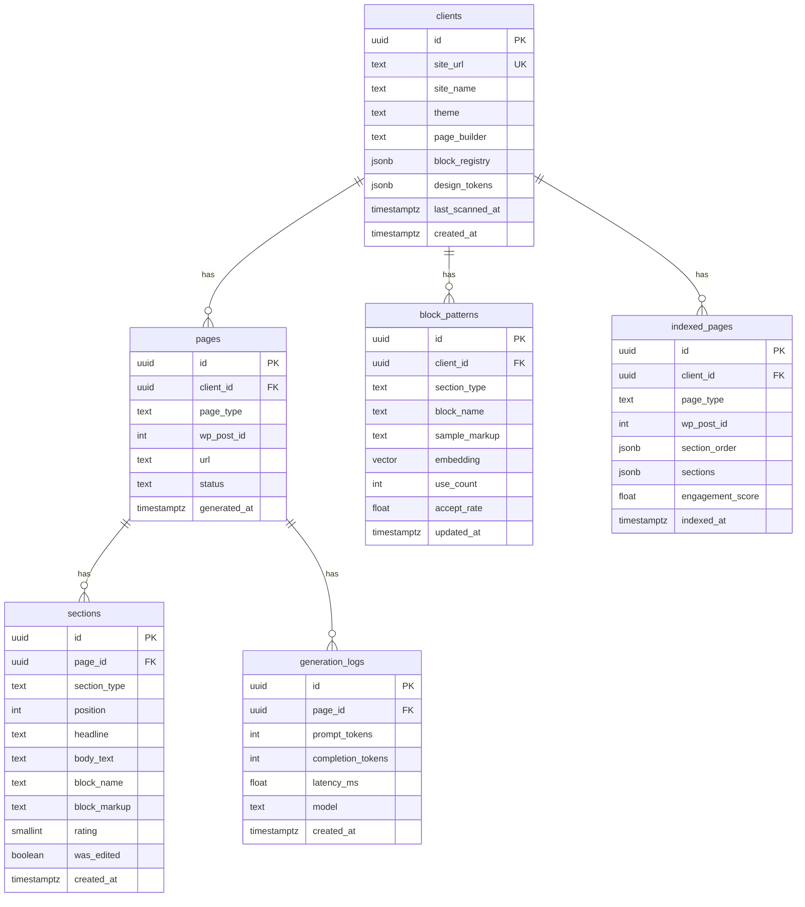
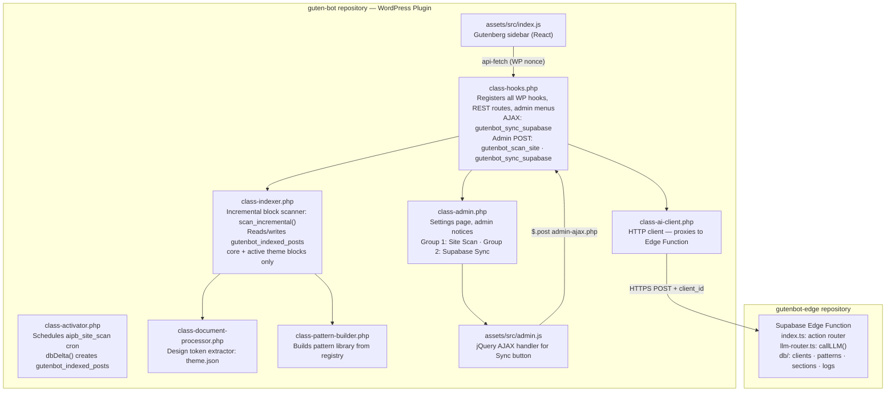
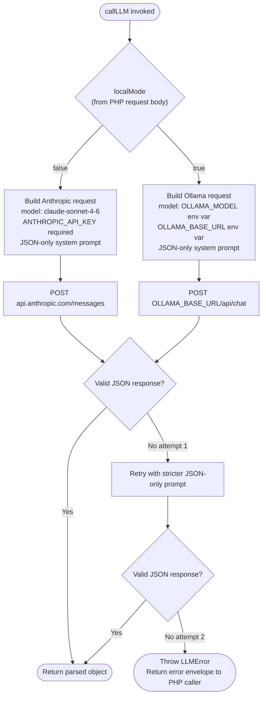

# GutenBot — Technical Architecture & Charts

> **Repository scope:** This repository (`guten-bot`) contains only the **WordPress plugin layer** (PHP classes, Gutenberg sidebar JS, WP-Cron, REST API). The Supabase Edge Function (Deno/TypeScript) and the PostgreSQL database schema live in the separate **`gutenbot-edge`** repository.

---

## 1. System Architecture Overview

---

## 2. Page Generation Sequence

Three-phase template synthesis: the LLM no longer invents page structure — it only fills content into an existing site layout.

---

## 3. Activation & Incremental Scan Sequence

Scan and Supabase sync are independent operations. Activation schedules a scan only; sync is always user-initiated.

---

## 4. Rating Flow

---

## 5. Database Entity Relationship Diagram

> Tables live in the `gutenbot-edge` repository (Supabase migrations).

---

## 6. Component Dependency Map

---

## 7. LLM Environment Routing

> `callLLM()` lives in `llm-router.ts` inside the `gutenbot-edge` repository. `localMode` is resolved by the PHP plugin from the `GUTENBOT_LOCAL_MODE` wp-config constant (defaults to `false`) and passed in the request body. There is no UI toggle — set the constant in `wp-config.php` for local dev only.

---

## 8. REST API Surface

| Method | Route / Action | Auth | Proxies to Edge |
|--------|---------------|------|-----------------|
| `POST` | `/wp-json/ai-pagebuilder/v1/generate` | `edit_pages` cap + WP nonce | `analyse_content` + `generate_blocks` |
| `POST` | `/wp-json/ai-pagebuilder/v1/rate` | `edit_pages` cap + WP nonce | `update_rating` |
| `GET` | `/wp-json/ai-pagebuilder/v1/status` | `edit_pages` cap + WP nonce | reads `wp_options` only |
| `POST` | `admin-post.php` action `gutenbot_scan_site` | `manage_options` + nonce | triggers incremental scan, redirects |
| `POST` | `admin-ajax.php` action `gutenbot_sync_supabase` | `manage_options` + nonce | `sync_client` — returns JSON, no redirect |

All REST endpoints return `HTTP 401` for unauthenticated requests. Admin POST/AJAX handlers use `wp_die()` on capability failure.
