# GutenBot — Behavioral Diagrams

Mermaid diagrams covering all major behaviors. Render in any Markdown viewer with Mermaid support (GitHub, VS Code + Mermaid extension, Obsidian, etc.).

> **Repository scope:** Diagrams 1–10 describe the full three-layer system for reference. Only the WordPress plugin layer (PHP classes, Gutenberg sidebar, WP-Cron, REST API) is implemented in this repository. The Edge Function and PostgreSQL database are in the separate **`gutenbot-edge`** repository.

---

## 1. System Context

High-level view of every actor and external system.

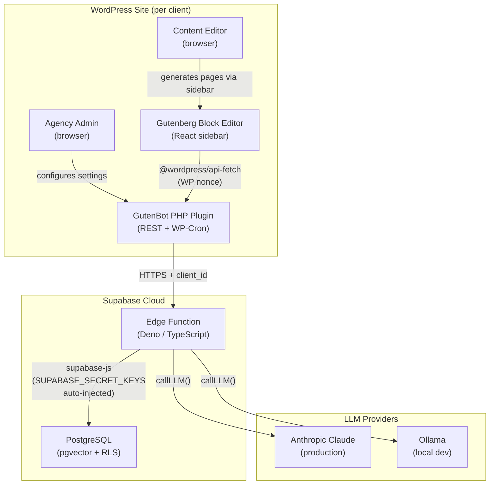

---

## 2. Plugin Activation & Site Scan Sequence

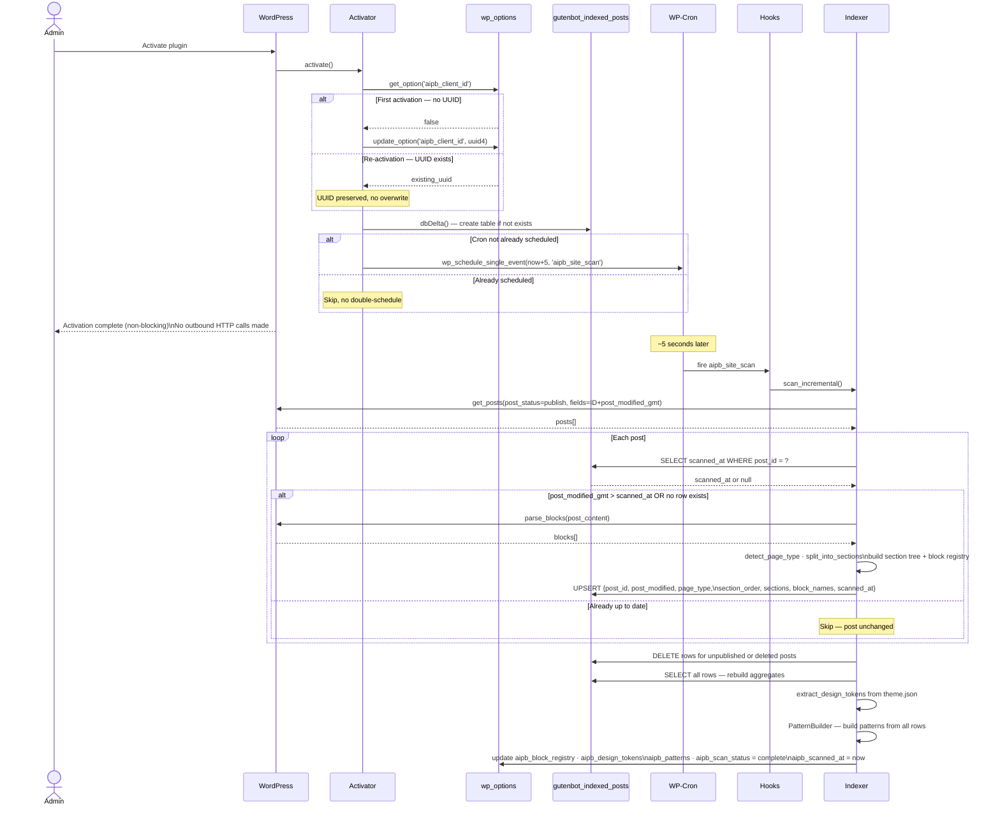

---

## 3. Page Generation Sequence

Three-phase template synthesis. The LLM resolves content only; layout structure comes from an existing indexed page.

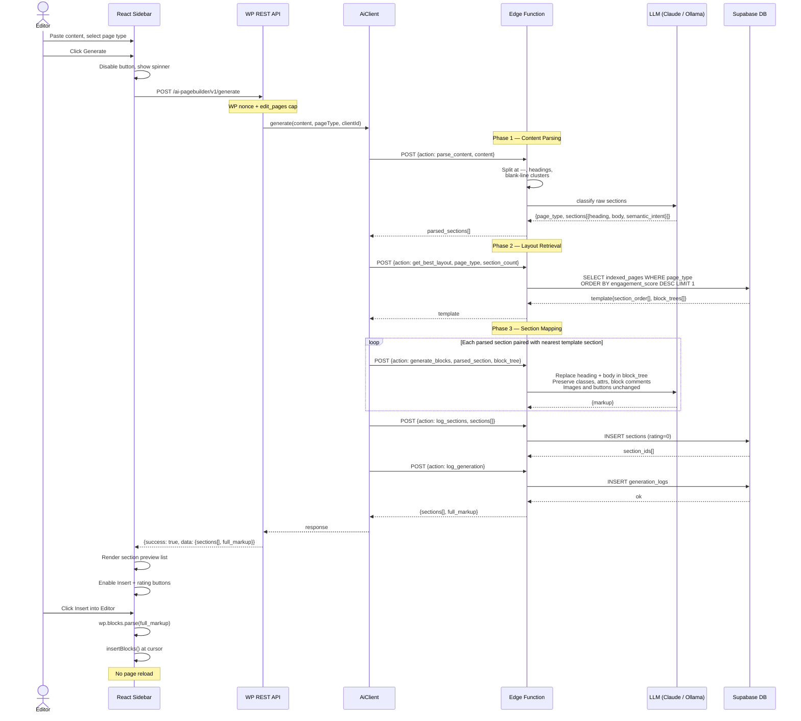

---

## 4. Rating Flow Sequence

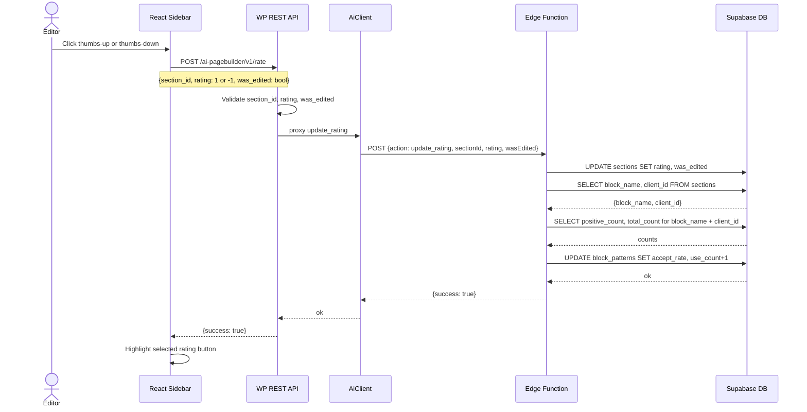

---

## 5. Status State Machines

Scan and sync are tracked independently. Scan does not require connection settings. Sync requires both scan data and connection settings.

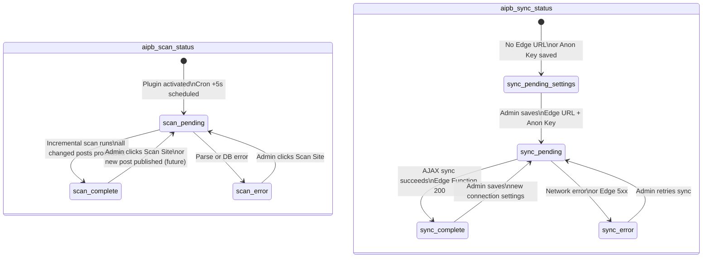

---

## 6. Block Scanner Activity Flow (Incremental)

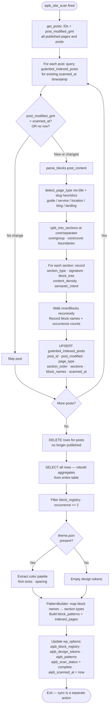

---

## 7. LLM Routing Decision Flow

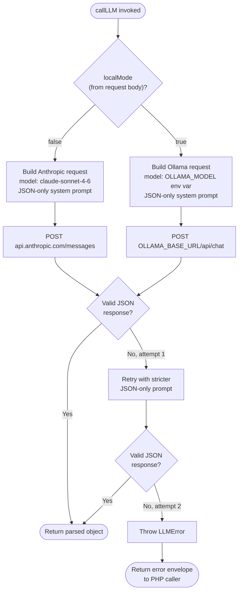

---

## 8. REST API Authorization Flow

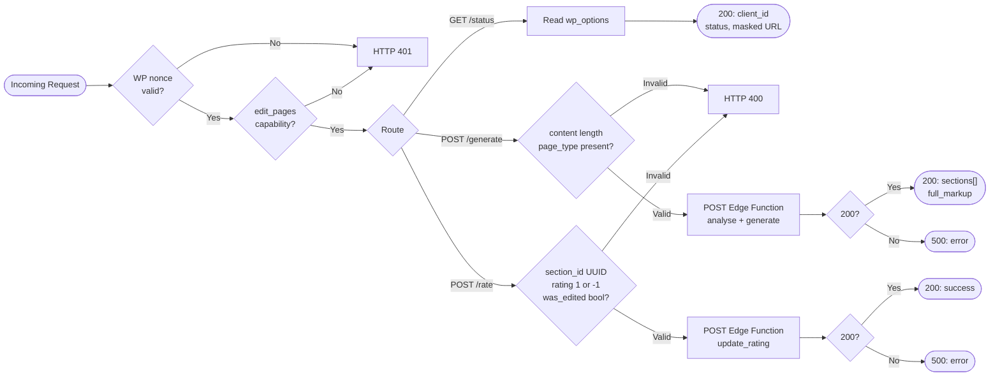

---

## 9. Settings Page Admin Flow

```mermaid
flowchart TD
    A([Admin opens Settings > AI Page Builder]) --> B[Load wp_options]
    B --> C[Render Connection Settings form\nEdge URL · Anon Key · LLM Provider]
    C --> D[Render Group 1 — Site Scan\nStatus badge · Last Scanned · Error · Scan Site button\nNo connection settings required]
    D --> E{can_sync?\nEdge URL + Anon Key\n+ Provider all saved?}
    E -- Yes --> F[Render Group 2 — Supabase Sync\nStatus badge · Last Synced · Client UUID\nSync to Supabase button enabled]
    E -- No --> G[Render Group 2 — Supabase Sync\nSync button hidden\nShow: Save settings to enable syncing]

    F --> H{Admin action}
    G --> H

    H -- Saves Connection Settings --> I[sanitize + update_option\naipb_edge_function_url · aipb_anon_key · aipb_provider]
    I --> J[on_connection_setting_saved:\nset aipb_sync_status = pending]
    J --> K([Redirect back to settings page])

    H -- Clicks Scan Site --> L[Form POST → admin-post.php\naction=gutenbot_scan_site + nonce]
    L --> M[Admin::handle_scan_site\ndo_action aipb_site_scan → incremental scan]
    M --> N([Redirect: ?gutenbot_scanned=success|error])

    H -- Clicks Sync to Supabase --> O[jQuery AJAX POST → admin-ajax.php\naction=gutenbot_sync_supabase + nonce]
    O --> P[Hooks::ajax_sync_supabase\nvalidate nonce + capability\nrun_supabase_sync]
    P --> Q{Success?}
    Q -- Yes --> R[JS updates badge to Complete\nUpdates synced_at timestamp inline\nNo page reload]
    Q -- No --> S[JS shows error message inline\nNo page reload]
```

---

## 10. PHP Class Relationships

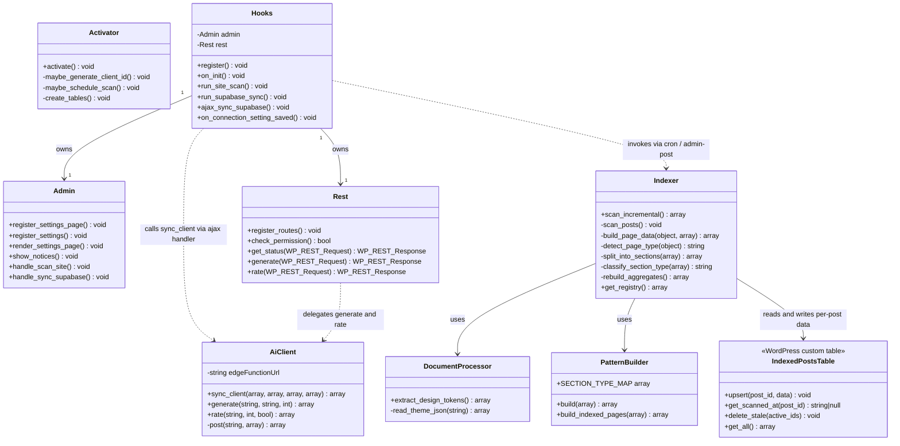

---

## 11. Database Entity Relationship

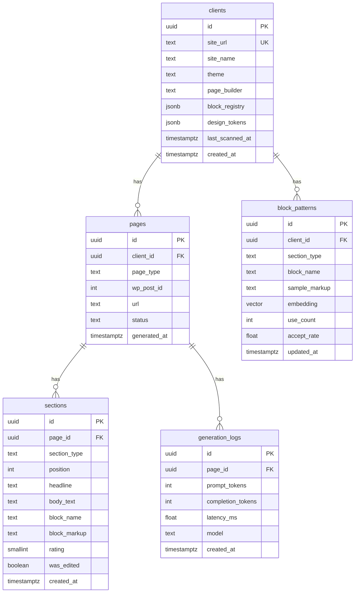

---

## 12. Edge Function Activity Flow — `gutenbot-edge` repo

Action router logic inside `index.ts`: how an incoming HTTP request is validated and dispatched to the correct handler, and what each handler does against the LLM and the database.

```mermaid
flowchart TD
    A([HTTP POST received]) --> B[Parse JSON body]
    B --> C{client_id\nin body?}
    C -- No --> E400A[Return 400\nmissing client_id]

    C -- Yes --> D[SELECT id FROM clients\nWHERE id = client_id]
    D --> E{Found?}
    E -- No --> E401[Return 401\nunknown client]

    E -- Yes --> F{action field}

    F -- sync_client --> SC1[UPSERT clients row\nsite_url, theme, tokens]
    SC1 --> SC2[Bulk UPSERT block_patterns\nfor this client_id]
    SC2 --> SC3[Bulk UPSERT indexed_pages\npage_type + section_order + block_trees]
    SC3 --> OK

    F -- parse_content --> PC1[Split raw content at ---\nheadings, blank-line clusters]
    PC1 --> PC2[callLLM: classify sections\nheading + body + semantic_intent]
    PC2 --> PC3{Valid JSON?}
    PC3 -- Yes --> OK
    PC3 -- No, attempt 1 --> PC4[Retry with stricter\nJSON-only prompt]
    PC4 --> PC5{Valid JSON?}
    PC5 -- Yes --> OK
    PC5 -- No, attempt 2 --> ELLM[Return LLMError\nenvelope]

    F -- get_best_layout --> GL1[SELECT indexed_pages\nWHERE page_type = input\nORDER BY engagement_score DESC\nLIMIT 1]
    GL1 --> GL2[Return section_order[]\nand block_trees[]]
    GL2 --> OK

    F -- generate_blocks --> GB1[For each section pair\nparsed section + template block_tree]
    GB1 --> GB2[callLLM: replace heading + body\nin block_tree\npreserve classes + attrs + block comments\nimages and buttons unchanged]
    GB2 --> GB3[Collect per-section markup]
    GB3 --> GB4[Concatenate full_markup]
    GB4 --> OK

    F -- log_sections --> LS1[INSERT sections rows\nrating = 0 initial]
    LS1 --> LS2[Return section UUIDs]
    LS2 --> OK

    F -- log_generation --> LG1[INSERT generation_logs\nprompt_tokens, latency_ms, model]
    LG1 --> OK

    F -- update_rating --> UR1[UPDATE sections\nSET rating, was_edited]
    UR1 --> UR2[SELECT positive_count\ntotal_count for block_name + client_id]
    UR2 --> UR3[UPDATE block_patterns\nSET accept_rate = positive / total\nuse_count + 1]
    UR3 --> OK

    F -- unknown --> E400B[Return 400\nunknown action]

    OK([Return success envelope\n{success: true, data: ...}])
    E400A --> DONE([Response sent])
    E401 --> DONE
    ELLM --> DONE
    E400B --> DONE
    OK --> DONE
```

---

## 13. AJAX Supabase Sync Flow

Triggered by the "Sync to Supabase" button on the settings page. Runs without a page reload.

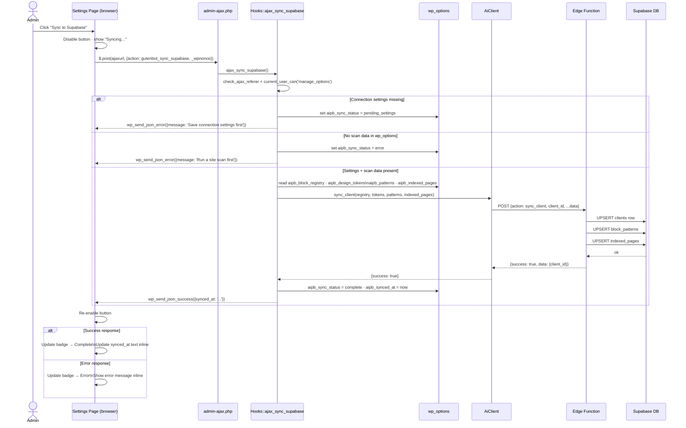
